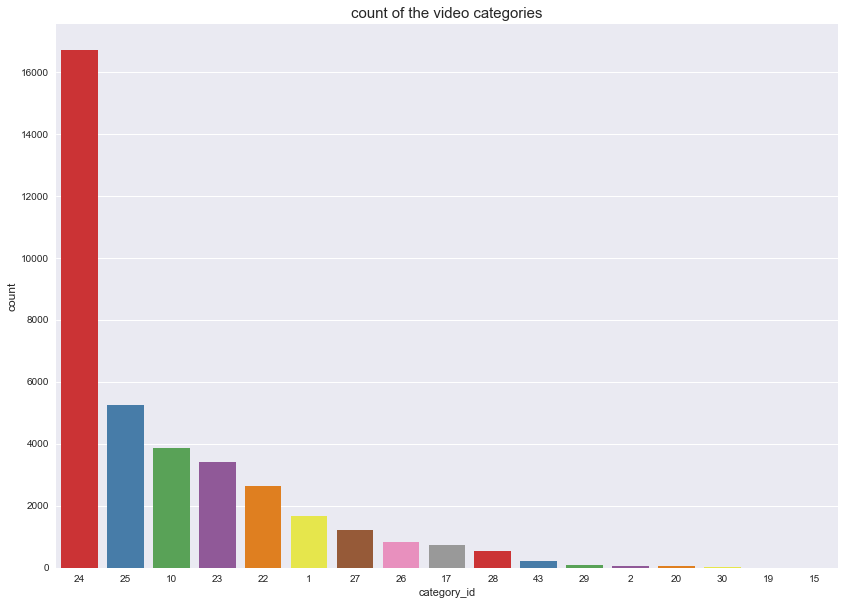
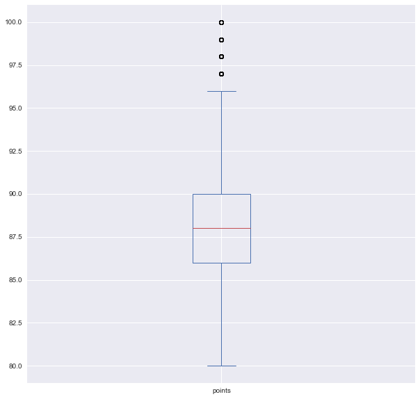

# Code for data mining preprocessing homework

## Reuqirements

`conda create -f preprocessing.yaml`  
`conda activate preprocessing`  
`pip install -r requiresments.txt`  

## Dataset

This homework uses two kaggle datasets:  

https://www.kaggle.com/zynicide/wine-reviews  
https://www.kaggle.com/datasnaek/youtube-new  

## Some visualization results from notebook

